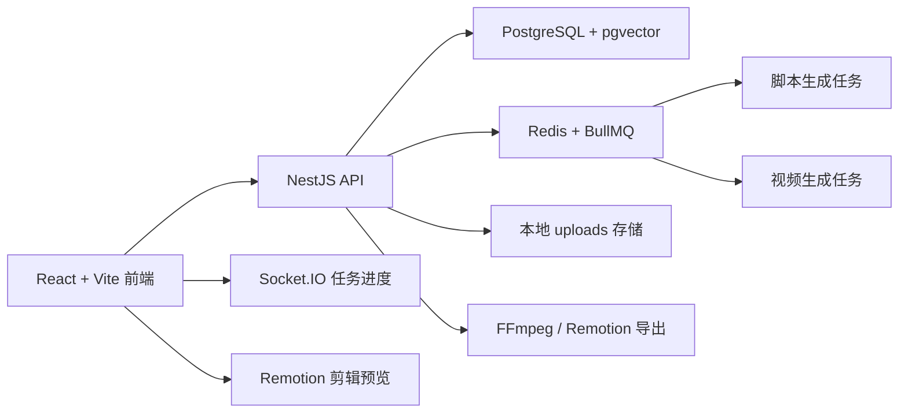

# TikTok_Shop AIGC 带货视频生成平台

## 项目概览

- **项目名称**：TikTok_Shop AIGC 带货视频生成平台
- **参赛课题**：TODO: 填写参赛课题
- **团队名称与成员名单**：TODO: 填写团队名称与成员名单
- **角色分工**：TODO: 填写成员分工，例如前端、后端、AI 工作流、部署与演示
- **提效形式**：TODO: 填写效率提升形式
- **一句话核心业务价值**：围绕 TikTok Shop 素材管理、脚本生成、视频生成、剪辑导出和数据看板，构建前后端分离的 AIGC 视频生产工作台，帮助商家更快规模化产出带货视频。

## 交付材料

- **在线 Demo 链接**：[http://115.29.186.188](http://115.29.186.188)
- **演示视频链接**：TODO: 填写 3-8 分钟演示视频链接
- **源码仓库链接**：TODO: 填写源码仓库链接
- **README / 运行说明**：见本文档下方“本地运行说明”
- **Agent Skill Package**：TODO: 如有 Agent 技能包，请填写链接

## 核心功能

1. **素材管理与理解**：支持本地素材上传、筛选、预览、删除，以及素材多模态分析的基础流程。
2. **脚本与灵感工作台**：提供支持素材关联的多种脚本生成入口、面向用户的灵感模板广场（支持填表快速生成带货视频方案）、后台模板管理、结构化分镜输出与脚本编辑能力，并支持在“我的作品”中集中管理生成结果。
3. **分镜视频生成**：基于分镜视觉提示和 Seedream 商品锚定首帧，并行生成独立视频片段。
4. **任务进度与异常恢复**：使用 BullMQ 与 WebSocket 推送任务进度，支持失败分镜重试。
5. **剪辑工作台**：提供类剪映的桌面剪辑页，支持素材片段导入、片段裁剪、顺序调整、缩略图时间线、转场拖入、整体 Remotion 预览和导出。
6. **数据看板与工作台入口**：提供主页概览、最近任务和创作入口。

## 2026-06-01 剪辑工作台更新

- 剪辑页融合到现有主页面框架中，保留全站左侧导航，剪辑内容区提供资源面板、整体预览、属性面板和底部时间线。
- 左侧素材片段和时间线片段均优先渲染 `thumbnail_url` 缩略图，缺失时显示带片段编号的渐变占位。
- 进入剪辑页后默认保持空时间线，左侧素材片段需要用户点击“加入”或拖入后才进入剪辑轨道。
- 转场预设支持拖入两个片段之间的时间线间隙；新增素材只新增片段，不再默认创建 `fade` 转场。
- 已有转场块已放大，便于点击、选中，并可在右侧属性面板精调类型、帧数或直接删除。
- 整体预览区域已放大，继续保持 9:16 比例；拖动 playhead 时只在松手后提交一次预览 seek，避免双进度线和抖动。
- 整体预览默认暂停，点击视频区域或按空格键才开始播放，再次点击或按空格可暂停。
- 素材片段裁剪后按源视频 in/out 区间稳定播放，Remotion Player 子树保持稳定且视频片段开启缓冲暂停，降低整体预览中途回退或黑帧风险。
- 剪辑页跟随全局浅色/深色主题；移动端访问剪辑页时提示用户在电脑端使用。
- 剪辑页已接入字幕 JSON 工程文件：后端可从剧本台词/旁白确定性初始化字幕，字幕文本优先跟随台词，剪辑页支持字幕列表、字幕轨、右侧属性编辑，并在 Remotion 预览和导出中烧录显示。
- 普通任务导出在检测到字幕工程文件时会自动走 Remotion 字幕烧录链路，保证预览页直接导出的完整视频也包含字幕。
- 预览页会加载字幕工程文件并在浏览器播放器上叠加当前台词字幕；首次初始化字幕时会优先按已生成分镜片段的实际时长排布 cue，旧的 `source: script` 自动字幕文件也会在读取时重排；相邻自动字幕之间保留 `0.01s` 起始间隔，且单段视频预览只显示当前片段时间范围内的字幕，避免镜头边界处提前显示下一段字幕；Seedream 首帧不携带台词文本，Seedance 视频 prompt 会保留口播台词作为声音/节奏参考，同时明确禁止画面内生成字幕、标题、促销文字、水印或乱码文字。
- 本轮仍不实现上传转场素材、语音识别字幕、SRT/VTT 导入导出或 BGM 多轨真实渲染。

## 2026-06-06 素材分析与字幕更新

- 剧本生成上下文已接入素材管理中的 AI 分析结果，包含素材级 `ai_tags`、`ai_description`，以及视频素材的语义切片起止时间、描述和标签。
- 剧本生成 Prompt 已明确要求优先参考素材 AI 分析与视频切片，减少生成与素材不匹配的分镜画面。
- 新增字幕 JSON 工程文件接口：`GET /api/v1/generation/tasks/:taskId/subtitles` 与 `PUT /api/v1/generation/tasks/:taskId/subtitles`，字幕文件保存到 `/uploads/subtitles/{taskId}.json`。
- 剪辑页字幕以最终时间线秒数为准，用户可在剪辑阶段二次修改；默认字幕优先使用分镜 `dialogue`，仅在台词为空时回退到 `subtitle`；导出时字幕随 `edit_project.subtitles` 进入 Remotion 渲染。
- 预览页/任务详情页直接导出时，如果字幕文件中存在 cue，后端会自动构建默认剪辑工程并使用 Remotion 渲染，避免字幕只在剪辑页导出中生效。
- 视频预览页的浏览器字幕覆盖层已缩小字号，并与实际生成片段时长对齐，降低遮挡画面和字幕提前出现的问题。

## 2026-06-09 结构化剧本蓝图更新

- 剧本生成已从“电商短视频字段列表”升级为结构化蓝图，固定输出 `script_blueprint`，包含基础设定、氛围与画质、声音规则，以及每个分镜的时间段、景别、构图、运镜、画面内容和分镜声音。
- 后端新增 `scripts.script_blueprint` JSONB 字段和生产迁移；AI 只返回蓝图分镜时，后端会自动映射为旧 `scenes`，保持视频生成、字幕和剪辑链路兼容。
- 脚本详情页新增“结构化剧本蓝图”编辑区，用户可直接调整全局设定与逐分镜镜头语言；保存蓝图时会同步更新对应 scene 的画面描述、运镜、时长和视频视觉提示。
- Seedream 首帧和 Seedance 分镜视频提示词会读取蓝图中的基础设定、氛围画质、声音规则和当前分镜详细内容，同时继续禁止画面内生成字幕、标题、水印和乱码文字。

## 端到端使用流程

用户进入系统后，先上传商品素材或选择已有素材。系统根据素材与商品信息生成带货脚本，并输出结构化分镜。用户启动视频生成任务后，后端异步队列按 independent 模式并行生成各个分镜视频，前端实时展示聚合进度和失败信息。任务完成后，用户可进入预览页查看各个片段，也可以进入剪辑工作台进行顺序调整、裁剪和转场配置。剪辑页使用整体预览检查最终节奏，并通过导出按钮生成成片。演示视频中应展示从素材到脚本、从脚本到分镜视频、从分镜到剪辑导出的完整链路。

## 技术说明

### 系统架构



### 核心技术栈

- **前端**：React 18、Vite、Ant Design、Zustand、Socket.IO client、Remotion Player、Vitest
- **后端**：NestJS、TypeORM、BullMQ、Socket.IO、Swagger、Jest
- **共享契约**：TypeScript shared-types，API 响应字段使用 snake_case
- **基础设施**：PostgreSQL 16 + pgvector、Redis 7、Docker Compose、Turborepo、pnpm workspace
- **AI 能力**：火山引擎大模型 ChatCompletion 与视频生成 API，开发阶段支持 `MOCK_MODE=true`

### LLM / AI 能力使用

- 使用大模型生成结构化剧本蓝图，先定义基础设定、氛围与画质、声音规则，再逐分镜输出时间段、景别、构图、运镜和画面内容，并映射为旧 `scenes` 供视频生成链路继续使用。
- 使用大模型进行素材的多模态理解分析，并根据商品特征与灵感模板输出 JSON Schema 格式的结构化脚本与分镜信息。
- 后端 AI 提示词已集中维护在 `packages/backend/src/ai/prompts`，覆盖剧本生成、素材分析、分镜视频、首帧生成和模板方案生成，避免提示词散落与编码漂移。
- 视频生成阶段优先使用分镜级 `visual_prompt` 和 `script_blueprint` 中的全局设定，降低全局叙事漂移并提升主体、风格、声音规则的一致性。
- 分镜视频生成支持商品图参考首帧：先用 Seedream 根据商品图生成商品锚定首帧，再将首帧作为 Seedance `first_frame` 输入并行生成视频片段。
- Seedream 首帧提示词只承载画面信息；Seedance 视频生成提示词保留口播台词作为声音/节奏参考，但字幕与旁白文件由后期字幕工程处理，提示词会显式禁止画面内文字、水印和乱码文字。
- 失败分镜可独立重试，已成功片段会保留，避免整条视频任务从头开始。

### 关键工程挑战与解决方案

- **长耗时 AI 任务反馈**：通过 Redis + BullMQ 解耦 HTTP 请求和生成任务，并用 Socket.IO 主动推送阶段进度。
- **前后端类型一致性**：使用 `packages/shared-types` 作为 API 契约源，前端和后端共享请求与响应结构。
- **分镜视频并行化**：每个分镜独立生成 Seedream 首帧并提交 Seedance 视频任务，整体进度按片段进度聚合；任一分镜失败不会中断其他分镜，重试时只补失败片段。
- **剪辑预览同步**：Remotion Player 仅使用每帧 `frameupdate` 驱动时间线 playhead，避免较旧的 `timeupdate` 把进度写回；有转场时整体预览总帧数会扣除转场重叠帧，保持 Player 时长与 `TransitionSeries` 实际时长一致。剪辑页整体预览默认不自动播放，点击画面或按空格才切换播放/暂停；Player 子树使用稳定 props 与 memo 隔离 playhead 高频更新，片段视频启用缓冲暂停，减少播放中途回退和黑帧。

## 部署与访问说明

- 在线体验地址当前记录为 [http://115.29.186.188](http://115.29.186.188)。
- 生产环境可使用 Docker Compose 编排 PostgreSQL、Redis、backend 和 frontend。
- 前端静态资源由 Nginx 托管，并反向代理 `/api`、`/socket.io` 和 `/uploads`。
- 上传和生成文件由 backend 的 `UPLOAD_DIR` 管理，默认开发路径为 `packages/backend/uploads`。

## 项目完成度与亮点

- **完成度**：核心 MVP 阶段。工程骨架、素材管理、脚本生成、灵感模板广场、任务队列、分镜生成、预览导出和剪辑工作台已打通。
- **亮点 1：全链路 AIGC 视频生产**：覆盖素材、脚本、分镜、视频生成、剪辑和导出，不只是单点模型调用。
- **亮点 2：分镜级并行生成与失败恢复**：提升长任务速度、可控性和演示稳定性。
- **亮点 3：类剪映剪辑体验**：在 Web 端提供主题跟随、缩略图时间线、可拖入转场和整体预览同步。
- **亮点 4：轻量级模板市场**：配备开箱即用的带货演示模板与全套内容生成机制（含视频脚本与发布文案），保障体验闭环与展示连贯性。

## 本地运行说明

### 环境要求

- Node.js 22
- pnpm 8+
- Docker / Docker Compose

### 启动步骤

```bash
cp .env.example .env
pnpm install
docker compose -f docker-compose.dev.yml up -d postgres redis
pnpm dev
```

也可以使用：

```bash
make dev
```

### 访问地址

| 服务 | 地址 |
| --- | --- |
| 前端应用 | http://localhost:5173 |
| 后端 API | http://localhost:3000/api/v1 |
| Swagger 文档 | http://localhost:3000/api/docs |
| 本地上传文件 | http://localhost:3000/uploads |
| WebSocket | `/tasks` |

### 常用命令

| 命令 | 说明 |
| --- | --- |
| `pnpm dev` | 启动前后端开发服务 |
| `pnpm lint` | 运行 ESLint |
| `pnpm typecheck` | 运行 TypeScript 类型检查 |
| `pnpm test` | 运行测试 |
| `pnpm build` | 构建所有 workspace package |
| `pnpm --filter @aigc/frontend typecheck` | 只检查前端类型 |
| `pnpm --filter @aigc/frontend test` | 只运行前端测试 |

### 目录结构

```text
TikTok_Shop/
├── packages/
│   ├── frontend/       # React + Vite 前端应用
│   ├── backend/        # NestJS 后端服务
│   ├── shared-types/   # 前后端共享 TypeScript 类型
│   └── video-renderer/ # Remotion 渲染与 CLI
├── docker/             # Dockerfile、Nginx、PostgreSQL 初始化脚本
├── AGENTS/             # 架构、API、项目进度与 Agent 文档
├── docker-compose.yml
├── docker-compose.dev.yml
├── package.json
├── pnpm-workspace.yaml
└── turbo.json
```

### 核心环境变量

| 变量 | 说明 |
| --- | --- |
| `MOCK_MODE` | 开发阶段可设为 `true`，使用 AI mock 流程 |
| `MOCK_DASHBOARD` | 是否为数据看板使用 Mock 数据，设为 `false` 时将请求外部统计系统 |
| `STATISTIC_API_URL` | 外部统计系统的 API 基础地址 (当 MOCK_DASHBOARD=false 时必填) |
| `VOLCANO_API_KEY` | 火山引擎 API Key，禁止提交真实密钥 |
| `VOLCANO_IMAGE_API_KEY` / `VOLCANO_IMAGE_ENDPOINT` / `VOLCANO_IMAGE_BASE_URL` | Seedream 首帧生成配置；未单独配置时 API Key/Base URL 可复用 `VOLCANO_API_KEY` / `VOLCANO_BASE_URL` |
| `VOLCANO_BASE_URL` | 火山引擎 API 基础地址 |
| `JWT_SECRET` | JWT 密钥，生产环境必须更换 |
| `UPLOAD_DIR` | 本地上传与生成文件目录 |
| `POSTGRES_USER` / `POSTGRES_PASSWORD` / `POSTGRES_DB` | PostgreSQL 配置 |

### CI 流程

GitHub Actions 会在 push/PR 到 `main` 时运行 lint、typecheck、backend test、frontend test、build 和 deploy（到阿里云服务器）。

