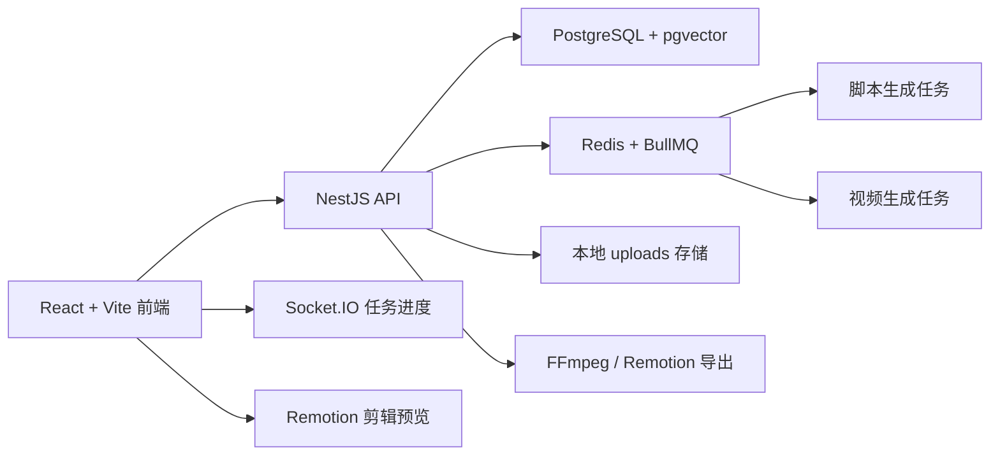

# TikTok_Shop AIGC 带货视频生成平台

**一句话核心业务价值**：围绕 TikTok Shop 素材管理、脚本生成、视频生成、剪辑导出和数据看板，构建前后端分离的 AIGC 视频生产工作台，帮助商家更快规模化产出带货视频。

## 核心功能

1. **素材与参考视频管理**：支持本地素材上传、筛选、预览、删除，以及通过 AI 提取素材标签和语义切片的**多模态分析流程**。支持原爆款参考视频的本地上传和多模态结构化异步拆解（包含 Hook 提取、镜头节奏和视听语言特征分析）。
2. **脚本与灵感工作台**：提供支持素材关联的多种脚本生成入口、支持 **【爆款仿写】生成模式**（可选择原爆款视频并提取拆解上下文进行 1:1 结构仿写）、面向用户的灵感模板广场（支持填表快速生成带货视频方案）与后台模板管理。生成剧本时支持选择 **“台词生成策略”**（自动/强制/不生成），并提供包含**双栏对比**（左侧直观对比原爆款解析）的脚本与**结构化蓝图**编辑能力。
3. **分镜视频生成**：基于分镜视觉提示和 Seedream 商品锚定首帧，并行生成独立视频片段。长剧本会自动拆分为多个分镜（单个分镜 4-12 秒），支持整体剧本 4-30 秒时长。
4. **任务管理与异常恢复**：支持自定义任务名称便于用户识别。使用 BullMQ 与 WebSocket 推送任务进度，独立并行生成视频片段，支持失败分镜独立重试。
5. **剪辑工作台**：提供类剪映的桌面剪辑页（融合主页框架，支持深浅主题），默认按分镜顺序铺好时间线。提供资源面板、整体预览、属性面板。支持素材与转场拖入、属性精调、片段裁剪、缩略图时间线。内置**独立字幕轨与字幕工程文件管理**，支持根据台词自动初始化字幕并在最终导出时通过 Remotion 进行硬字幕烧录。
6. **数据看板与工作台入口**：提供主页概览、统一的创作流程引导、最近任务和创作入口，并在“我的作品”中集中管理生成结果。

## 端到端使用流程

主页提供了统一的创作流程引导，按“上传素材 → 生成剧本 → 新建创作 → 剪辑导出”串起完整生产路径。用户进入系统后，先上传商品素材或选择已有素材。系统根据素材分析与参考视频拆解信息生成带货脚本，并输出结构化蓝图。用户启动带有自定义名称的创作任务后，后端异步队列按 independent 模式并行生成各个分镜视频，前端实时展示聚合进度和失败信息。任务完成后，用户从任务详情直接进入剪辑工作台，时间线自动按生成顺序铺好并包含已初始化的台词字幕。用户可通过稳定的整体预览检查最终节奏，精调转场和字幕，最终使用 Remotion 导出包含烧录字幕的成片。演示视频中应展示从素材到脚本、从脚本到分镜视频、从分镜到剪辑导出的完整链路。

## 技术说明

### 系统架构



### 核心技术栈

- **前端**：React 18、Vite、Ant Design、Zustand、Socket.IO client、Remotion Player、Vitest
- **后端**：NestJS、TypeORM、BullMQ、Socket.IO、Swagger、Jest（详细接口见 [`AGENTS/openapi.json`](./AGENTS/openapi.json)，数据库 ER 图见 [`AGENTS/database_er.mermaid`](./AGENTS/database_er.mermaid)）
- **共享契约**：TypeScript shared-types，API 响应字段使用 snake_case
- **基础设施**：PostgreSQL 16 + pgvector、Redis 7、Docker Compose、Turborepo、pnpm workspace
- **AI 能力**：火山引擎大模型 ChatCompletion 与视频生成 API，开发阶段支持 `MOCK_MODE=true`

### LLM / AI 能力使用

- **结构化剧本蓝图生成**：使用大模型生成结构化剧本蓝图，先定义基础设定、氛围与画质、声音规则，再逐分镜输出时间段、景别、构图、运镜和画面内容，并严格按用户选择的台词策略生成或禁用分镜 `dialogue/subtitle`，最后映射为旧 `scenes` 供视频生成链路继续使用。
- **多模态理解与拆解**：使用火山引擎大模型及 File API 对本地素材和原爆款参考视频进行多模态结构化拆解，输出 JSON Schema 格式的报告（包含 Hook 设计、镜头节奏和视听语言特征），作为【爆款仿写】和剧本生成的关键上下文。
- **提示词集中管理**：后端 AI 提示词已集中维护在 `packages/backend/src/ai/prompts`，覆盖剧本生成、素材分析、分镜视频、首帧生成和模板方案生成，避免提示词散落与编码漂移。
- **分镜视频生成一致性**：视频生成阶段优先使用分镜级 `visual_prompt` 和 `script_blueprint` 中的全局设定，降低全局叙事漂移并提升主体、风格、声音规则的一致性。分镜视频生成支持商品图参考首帧：先用 Seedream 根据商品图生成商品锚定首帧，再将首帧作为 Seedance `first_frame` 输入并行生成视频片段。
- **图文与恢复策略**：Seedream 首帧提示词只承载画面信息；Seedance 视频生成提示词保留口播台词作为声音/节奏参考，但明确禁止在画面内生成字幕、标题、促销文字或水印（最终文字通过后期剪辑工程 Remotion 添加）。由于分镜间独立并行生成，失败分镜可独立重试，已成功片段会保留，避免任务整体重头开始。

### 关键工程挑战与解决方案

- **长耗时 AI 任务反馈**：通过 Redis + BullMQ 解耦 HTTP 请求和生成任务，并用 Socket.IO 主动推送阶段进度。
- **前后端类型一致性**：使用 `packages/shared-types` 作为 API 契约源，前端和后端共享请求与响应结构。
- **分镜视频并行化**：每个分镜独立生成 Seedream 首帧并提交 Seedance 视频任务，整体进度按片段进度聚合；任一分镜失败不会中断其他分镜，重试时只补失败片段。
- **剪辑预览同步**：Remotion Player 仅使用每帧 `frameupdate` 驱动时间线 playhead，避免较旧的 `timeupdate` 把进度写回；有转场时整体预览总帧数会扣除转场重叠帧，保持 Player 时长与 `TransitionSeries` 实际时长一致。剪辑页整体预览默认不自动播放，点击画面或按空格才切换播放/暂停；Player 子树使用稳定 props 与 memo 隔离 playhead 高频更新，片段视频启用缓冲暂停，减少播放中途回退和黑帧。

## 部署与访问说明

- 生产环境可使用 Docker Compose 编排 PostgreSQL、Redis、backend 和 frontend。
- 前端静态资源由 Nginx 托管，并反向代理 `/api`、`/socket.io` 和 `/uploads`。
- 上传和生成生产文件由 backend 的 `UPLOAD_DIR` 管理，默认开发路径为 `packages/backend/uploads`。

### 数据库迁移与初始化规约

- **本地开发**：默认开启了 TypeORM 的 `synchronize: true`，启动服务时会自动同步和创建表结构。
- **生产环境**：生产环境禁用了 `synchronize`。**所有的建表、字段修改（包括初次部署时的全量建表）都必须由 TypeORM Migration 接管**。部署到线上后，务必在后端容器内执行 `pnpm --filter @aigc/backend migration:run`（或对应的直接 node 命令）来同步结构，否则会出现 `relation does not exist` 的错误。

## 项目完成度与亮点

- **完成度**：核心 MVP 阶段。工程骨架、素材管理、脚本生成、灵感模板广场、任务队列、分镜生成、预览导出和剪辑工作台已打通。
- **亮点 1：全链路 AIGC 视频生产**：覆盖素材、脚本、分镜、视频生成、剪辑和导出，不只是单点模型调用。
- **亮点 2：分镜级并行生成与失败恢复**：提升长任务速度、可控性和演示稳定性。
- **亮点 3：类剪映剪辑体验**：在 Web 端提供主题跟随、缩略图时间线、可拖入转场和整体预览同步。
- **亮点 4：轻量级模板市场**：配备开箱即用的带货演示模板与全套内容生成机制（含视频脚本与发布文案），保障体验闭环与展示连贯性。

## 本地运行说明

### 环境要求

- Node.js 22
- pnpm 8+
- Docker / Docker Compose

### 启动步骤

```bash
cp .env.example .env
pnpm install
docker compose -f docker-compose.dev.yml up -d postgres redis
pnpm dev
```

也可以使用：

```bash
make dev
```

### 访问地址

| 服务         | 地址                           |
| ------------ | ------------------------------ |
| 前端应用     | http://localhost:5173          |
| 后端 API     | http://localhost:3000/api/v1   |
| Swagger 文档 | http://localhost:3000/api/docs |
| 本地上传文件 | http://localhost:3000/uploads  |
| WebSocket    | `/tasks`                     |

### 常用命令

| 命令                                       | 说明                       |
| ------------------------------------------ | -------------------------- |
| `pnpm dev`                               | 启动前后端开发服务         |
| `pnpm lint`                              | 运行 ESLint                |
| `pnpm typecheck`                         | 运行 TypeScript 类型检查   |
| `pnpm test`                              | 运行测试                   |
| `pnpm build`                             | 构建所有 workspace package |
| `pnpm --filter @aigc/frontend typecheck` | 只检查前端类型             |
| `pnpm --filter @aigc/frontend test`      | 只运行前端测试             |

### 目录结构

```text
TikTok_Shop/
├── packages/
│   ├── frontend/       # React + Vite 前端应用
│   ├── backend/        # NestJS 后端服务
│   ├── shared-types/   # 前后端共享 TypeScript 类型
│   └── video-renderer/ # Remotion 渲染与 CLI
├── docker/             # Dockerfile、Nginx、PostgreSQL 初始化脚本
├── AGENTS/             # 架构、API、项目进度与 Agent 文档
├── docker-compose.yml
├── docker-compose.dev.yml
├── package.json
├── pnpm-workspace.yaml
└── turbo.json
```

### 核心环境变量

| 变量/前缀                                                                           | 说明                                                                                             |
| ----------------------------------------------------------------------------------- | ------------------------------------------------------------------------------------------------ |
| `NODE_ENV` / `PROJECT_NAME`                                                         | 基础运行环境配置，`development` 模式下自动开启数据库同步                                         |
| `POSTGRES_*` / `REDIS_*`                                                            | PostgreSQL 数据库与 Redis 缓存连接配置                                                           |
| `BACKEND_PORT` / `FRONTEND_PORT` / `API_PREFIX`                                     | 网络服务端口与 API 路由前缀                                                                      |
| `VOLCANO_API_KEY` / `VOLCANO_BASE_URL`                                              | 火山引擎通用 API Key 与基础地址，默认作为各模态的回退配置（禁止提交真实密钥）                    |
| `VOLCANO_TEXT_*` / `VOLCANO_IMAGE_*` / `VOLCANO_VIDEO_*` / `VOLCANO_EMBEDDING_*`    | 文本、图片、视频、向量化大模型的独立 Endpoint、计费单价及独立鉴权配置                            |
| `VOLCANO_VIDEO_...` / `VOLCANO_CHAT_TIMEOUT_MS`                                     | 视频生成任务与文本生成接口的精细化参数配置（时长限制、重试次数、轮询间隔与 HTTP 超时时间）       |
| `MOCK_MODE` / `MOCK_DASHBOARD` / `MOCK_*_URL`                                       | 开发与调试使用的 Mock 数据流程开关及模拟素材 URL 配置                                            |
| `STATISTIC_API_URL`                                                                 | 外部统计系统的 API 基础地址（当 `MOCK_DASHBOARD=false` 时必填）                                  |
| `JWT_SECRET` / `VITE_TEMP_KEY_SECRET`                                               | JWT 鉴权密钥及前后端临时 API Key 加密传输密钥（生产环境必须更换）                                |
| `STORAGE_TYPE` / `UPLOAD_DIR` / `MAX_FILE_SIZE_*`                                   | 本地存储驱动、上传目录及音视频图片等媒体的单文件大小限制配置                                     |
| `FFMPEG_PATH`                                                                       | 视频拼接与抽帧所依赖的 FFmpeg 路径配置（若系统环境中已有则无需设置）                             |

### CI 流程

GitHub Actions 会在 push/PR 到 `main` 时运行 lint、typecheck、backend test、frontend test、build 和 deploy（到阿里云服务器）。
